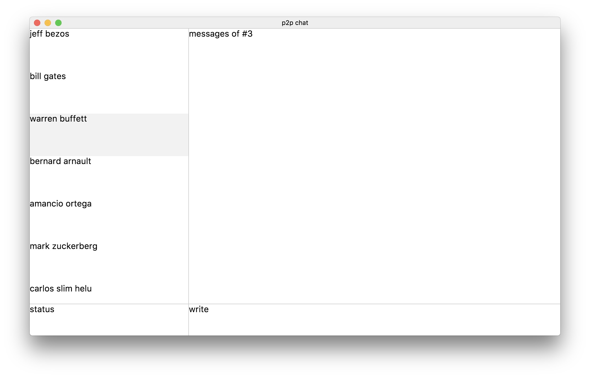

# p2p chat
A peer to peer chat app built with [React](https://reactjs.org/), [Redux](https://redux.js.org/) and [Electron](https://electronjs.org/).

## Contribution
Feel free to contribute. Open a new [issue](https://github.com/ozgrozer/p2p-chat/issues), or make a [pull request](https://github.com/ozgrozer/p2p-chat/pulls).

## License
[MIT](https://github.com/ozgrozer/p2p-chat/blob/master/license)
